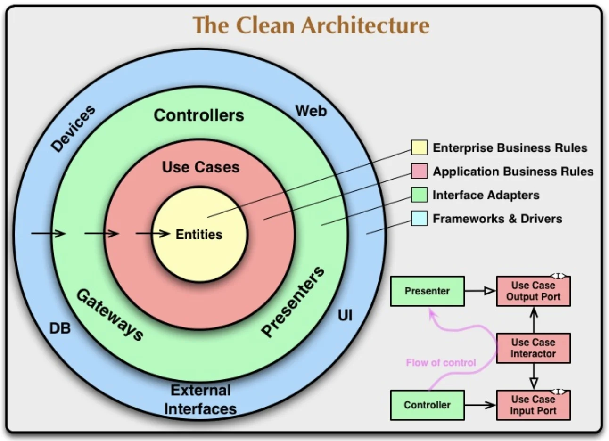

# Clean Architecture

## Mục tiêu

- Độc lập các công cụ
- Sự độc lập của các cơ chế phân phối
- Khả năng cô lập kiểm thử

  NOTE: Có một nguyên tắc khi viết các ứng dụng theo Clean Architecture đó là, như các bạn thấy trong hình vẽ trên chỗ các dấu mũi tên từ ngoài vào trong, những thay đổi của lớp bên ngoài sẽ không ảnh hưởng gì đến code của những lớp bên trong. Những lớp bên trong sẽ không biết code của những lớp bên ngoài có gì.

## Cấu trúc

### - Entities (thực thể)

- `Entities` là `layer` trong cùng, cũng là `layer` quan trọng nhất. `Entity` chính là các thực thể hay từng đối tượng cụ thể và các `rule business logic` của nó. Trong `OOP`, đây chính là `Object` cùng với các `method` và `properties` tuân thủ nguyên tắc `Encapsulation` - chỉ bên trong `Object` mới có thể thay đổi trạng thái `(State)` của chính nó.

- VD: Trong object Person thì thuộc tính age không thể bé hơn 1. Nếu cần thay đổi age, chúng ta phải viết hàm public setAge, hàm này cũng chịu trách nhiệm check điều kiện liên quan tới age.

- Các business logic của layer Entities sẽ không quan tâm hay lệ thuộc vào các business logic ở các layer bên ngoài như Use Cases. Giả sử với trường hợp người dùng phải từ 18 tuổi trở lên mới được phép tạo tài khoản thì rule thuộc tính Age trong Entities vẫn không đổi.

### - Use Case (Trường hợp sử dụng)

- `Use Cases` là layer chứa các business logic ở cấp độ cụ thể từng `Use Case` (hay application).

- VD: `Use Case` đăng ký tài khoản (tạo mới một Person/Account) sẽ cần tổ hợp một hoặc nhiều `Entities` tuỳ vào độ phức tạp của `Use Case`.

- Các `business logic` của `Use Case` đương nhiên cũng sẽ không quan tâm và lệ thuộc vào việc dữ liệu đến từ đâu, dùng các thư viện nào làm `apdapter`, dữ liệu thể hiện thế nào,... Vì đấy là nhiệm vụ của `layer Interface Adapters`.

- Với ứng dụng quản lý sinh viên ở trên thì các use cases mà chúng ta có thể định nghĩa trong lớp này là các class cho phép chúng ta thêm, xoá, sửa, cập nhập thông tin sinh viên.

  NOTE : Một điều lưu ý với 2 lớp trên, Entities và Use Cases, là chúng ta sẽ không sử dụng bất kỳ một external library hay framework nào, ngoài trừ lớp Use Cases thì có thể cần sử dụng các library liên quan đến Unit Testing.

### - Interface Adapters (Bộ điều hợp giao diện)

- VD: Thông tin người dùng sẽ có một số thông tin rất nhạy cảm như Email, Phone, Address. Không phải lúc nào dữ liệu cũng về đầy đủ để phục vụ GUI (Web, App). Tương tự với tuỳ vào hệ thống Database mà các adapter phải format dữ liệu hợp lý.

- Như vậy dữ liệu đầu vào và ra ở tầng Interface Apdapter chỉ cần đủ và hợp lý. Nó sẽ không quan tâm việc dữ liệu sẽ được hiển thị cụ thể như thế nào cũng như được thu thập như thế nào. Vì đó là nhiệm vụ của tầng Frameworks & Drivers.

  NOTE : Để các use cases có thể nói chuyện với các external system như database, web service, MQ server, chúng ta cần một lớp gọi là lớp Adapter (màu xanh lá cây). Sử dụng Java thì lớp Adapter này chứa những interface để cho lớp Use Cases sử dụng. Những interface này sẽ được implement bởi những thành phần ở lớp ngoài cùng trong hình vẽ trên (màu xanh dương) tuỳ theo nhu cầu của ứng dụng. Trong ví dụ về ứng dụng quản lý sinh viên thì chúng ta có thể định nghĩa các interface để lấy thông tin sinh viên từ database, cập nhập thông tin sinh viên,…

### - Frameworks & Drivers

- Frameworkd & Drivers là tầng ngoài cùng, tổ hợp các công cụ cụ thể phục vụ cho từng nhu cầu của end user như: thiết bị (devices), web, application, databases,... Trong kiến trúc Clean Architecture thì ở tầng này là "nhẹ" nhất vì chúng ta không cần phải viết quá nhiều code.

- Trên thực tế thì đây là nơi "biết tất cả" cụ thể các tầng là gì thông qua việc chịu trách nhiệm khởi tạo các objects cho các tầng bên trong (hay còn gọi là Setup Dependencies)

> Để các layer trong Clean Architecture có thể làm việc được nhưng lại độc lập với nhau thì chúng sẽ dùng các Interfaces.

## Ưu nhược điểm

### Nhược điểm của Clean Architecture

- Cồng kềnh và phức tạp: Điều dễ thấy nhất là Clean Architecture không hề dễ sử dụng, phải viết nhiều lớp (class/object) hơn. Trong trường hợp ứng dụng của bạn quá đơn giản, ít tính năng, vòng đời ngắn thì chọn lựa kiến trúc này có thể mang lại những rắc rối không cần thiết.

- Tính trừu tượng cao: Vấn đề này gọi là indirect. Trừu tượng càng cao thì tiện cho các developers nhưng sẽ gây ảnh hưởng không nhỏ tới tốc độ thực thi (performance). Ngoài ra cũng không thể code nhanh, vội vã "mì ăn liền" được mà phải tạo đủ các Interfaces.

- Khó tuyển người: Sử dụng Clean Architecture sẽ cần tuyển dụng developer thấu hiểu về kiến trúc này. Nguyên tắc Dependency Inversion rất dễ bị xâm phạm vì sự hạn chế kiến thức, sự bất cẩn hoặc vì thời gian cần triển khai tính năng quá ít.

### Ưu điểm của Clean Architecture

- Chia để trị rất hiệu quả trong ứng dụng lớn: Trong Clean Architecture thì code tầng nào thì ở đúng tầng nấy. Hạn chế được việc "code ở đâu cũng là code, chạy được là được". Nếu làm tốt được các bài toán nhỏ thì không có bài toán lớn nào không giải quyết được.

- Rất dễ maintain và mở rộng: Việc tìm kiếm bug và lỗi logic sẽ trở nên dễ dàng và nhanh hơn, file code sẽ không nhiều vì chỉ làm đúng việc của nó. Vì các tầng độc lập với nhau thông qua các Interfaces nên việc mở rộng hoặc thay đổi các tầng sẽ không ảnh hưởng tới nhau. Điều này hạn chế các breaking change cũng như phải viết lại code (refactoring).

- Rất dễ làm Unit Test: Các logic business của các tầng trong Clean
  Architecture chính là các Unit Test cần được kiểm thử rất cẩn thận. Vì sự độc lập thông qua Interfaces nên các mock test rất dễ triển khai. Việc này được thực hiện thông qua implement lại để coverage được tất cả các trường hợp.

## Sử dụng kiến trúc Clean Architecture sao cho hợp lý

- Đầu tiên không phải một ứng dụng và sản phẩm công nghệ nào cũng đầy đủ 4 tầng Entities, Use Cases, Interface Adapters và Frameworks & Drivers. Chúng ta có thể linh động tăng hoặc giảm số tầng cho phù hợp. Trong thực tế, hầu hết các kỹ sư sẽ chỉ tham khảo kiến trúc này để có được các kiến trúc phù hợp hơn.

- Chúng ta chỉ cần nhớ rằng thay vì thực hiện các business logic ở một nơi (một class hoặc một hàm duy nhất) thì nên chia chúng thành các layer chịu trách nhiệm riêng biệt. Các layer này độc lập với nhau, không sử dụng trực tiếp các concrete object mà thay vào đó là các Interfaces.
